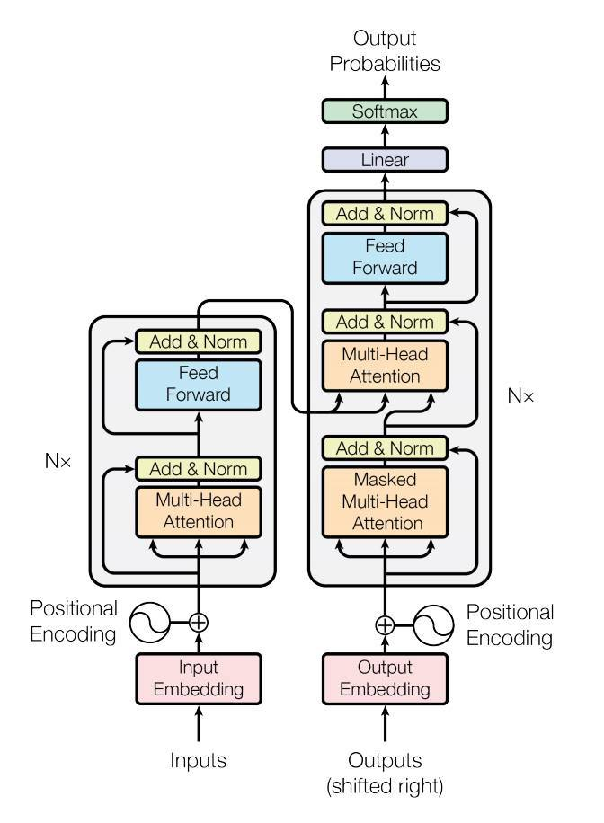

<div align="center">

</a>
</div>

# COMS-6998: Distributed Training
#### Alex Preau (awp2128) and Skyler Szot (sls2305)

<div align="center">
  
</div>  
<div align="center">
  
</div>  

## I. Project Description

Training a deep learning model to solve a real world problem requires a lot of data, which can be very time consuming. To ensure better efficiency and less time consumption, researchers can leverage parallel training approaches. We will be comparing various methods of parallel training of deep learning models in PyTorch. There are many proposed methods for this problem, from SIMD-like methods of averaging the gradients of batches computed on each independent GPU, to sharding and computing the parallel components of the computational graph independently. In this project, we will be comparing the advantages and disadvantages of these distributed training approaches.

#### Objective 1: PyTorch Baseline

This project aims to investigate various distributed training techniques for deep learning training. Our first goal is to implement and train various models in PyTorch as a baseline, without any distributed training optimizations. The models investigated in this report are ResNet-18, ResNet-50, and the ALBERT transformer model. For the majority of experiments we utilized the CIFAR-10 dataset

#### Objective 2: Horovod Distributed Training

Our second objective is to implement the same models PyTorch, but now with distributed gradient computation and averaging across multiple GPUs using Horovod [1]. Horovod is a distributed deep learning training framework for PyTorch, which makes distributed deep learning fast and easy to use. Each GPU trains on a subset of data, and gradients are synchronized with an allreduce or allgather step [1]. We will compare the distributed training results with the baseline to investigate which cases benefit from multi-GPU training.

<div align="center">

</div>

#### Objective 3: Fair Scale

TODO

#### Thrust 4: Pipelining

Our final objective is to utilize a pipeline parallelism approach, using the inbuilt Pipe APIs in PyTorch. Typically for large models which don’t fit on a single GPU, model parallelism is employed where certain parts of the model are placed on different GPUs. Although, if this is done naively for sequential models, the training process suffers from GPU under utilization since only one GPU is active at one time as shown in the figure below. To alleviate this problem, pipeline parallelism splits the input minibatch into multiple microbatches and pipelines the execution of these microbatches across multiple GPUs.

<div align="center">

</div>

## II. Repository Description

The repsitory is a fork of [2] with additions to the data handling module, deep learning module, and main execution module. Moreover, custom scripts were added for class activation mapping and further model characterization. The basis structure of the repository is below. The `__checkpoint__` folder is used to automatically store the `.log` files recording the results and the `.pth` trained model files with examples shown for two separate test runs `100` and `101`. The results from the `.log` file are more conveniently stored in a `seaborn`-friendly csv format in the `pytorch/results/` folder, with examples shown from two tests. 

```
distributed_dl/
├── fairseq
│   ├── fairseq_albert.py
│   ├── fairseq_test.py
├── horovod
│   ├── pytorch_resnet_cifar10.py
├── pipeline
│   ├── pipeline_tutorial.py

```

The repository is organized into folders for each of our model objectives. All experiments were conducted using PyTorch and each requires a separate setup procedure.

## III. Example Commands

### Horovod

#### System Requirements

The Horovod experiments were conducted on a Google Cloud instance with two Tesla T4 GPUs. In order to create an instance with multiple GPUs, you must make a quota increase request. The Google Cloud instance was initialized with boot disk Debian 10 based Deep Learning VM for PyTorch CPU/GPU with CUDA 11.3 M102. This comes with PyTorch 1.12 and CUDA 11.3 pre-installed.

Horovod can be installed with:
```
pip install horovod
```

#### Example run command
Horovod can be run with the following command, specifying the number of GPUs to use.
```
horovodrun -np 2 python pytorch_resnet_cifar10.py
```

### Pipelining

#### System Requirements

The pipelining experiments were conducted on a Google Cloud instance with two Tesla T4 GPUs, and the same boot disk Debian 10 based Deep Learning VM for PyTorch CPU/GPU with CUDA 11.3 M102. You must use the disk image with PyTorch 1.12, and there is no additional installation needed for the pipelining API which is included in PyTorch.

Additional installation steps required to run the pipelining script:
```
pip install torchtext==0.13.0
pip install torchdata==0.4.0
```

#### Example run command
The pipelining script can be run with the following command:
```
python pipeline_tutorial.py
```

## IV. Results

#### Horovod Distributed Training

Horovod accelerates deep learning training by distributing batches across multiple GPUs. Each device gets a separate copy of the model, and the weights are updated with an All-Reduce step. We investigated ResNet-18 (~11 million trainable parameters) and ResNet-50 (~23 million trainable parameters) training using Horovod on the CIFAR-10 dataset. CIFAR-10 is a popular computer vision dataset for object recognition, and contains 60,000 32x32 color images containing one of 10 object classes, with 6000 images per class. We investigated 36 combinations of model, batch size, precision at the All-Reduce step, and number of GPUs. The different options used are as follow:

- Model: ResNet-18, ResNet-50
- Batch size: 32, 64, 128, 256, 512, 1024
- Precision: FP32, FP16, N/A
- # GPU: 1, 2

Note that when using a single GPU there is no All-Reduce step so precision is not applicable. We recorded the throughput for each training configuration as samples/second (or images/second). We did not record loss or accuracy which had negligible variation. The full table of results are shown below:

<div align="center">

</div>

<div align="center">

</div>

From the results, ResNet-18 has higher throughput than ResNet-50 as expected, because a smaller model requires less computations to train. Another interesting observation was the effect of the All-Reduce precision. In some cases like ResNet-18 with batch size 32, halving the precision nearly doubled the throughput. This indicates that the All-Reduce step was the bottleneck. In other cases like ResNet-50 with batch size 512 there is a much smaller improvement. Due to the more complex model and larger batch, there is much more computation to be done on each GPU making the All-Reduce precision less important. Batch size also had interesting behavior, and performance seemed to peak around a batch of 256 or 512. It seems that a larger batch improves performance up until a certain point when the GPU memory is saturated, and then has worsened performance.

The best performing configuration for ResNet-18 actually just used a single GPU with batch size 256. It seems that the model is too small to make batch distribution worthwhile, and it is most efficient to just train on a single GPU without having to share gradients. However, ResNet-50 had the best performance with 2 GPUs, a batch size of 512, and FP16 All-Reduce precision. When using a larger model it is most efficient to distribute the training because much more time is spent computing gradients, making the communication cost of sharing gradients worthwhile.

#### Pipelining

Pipeline parallelism is a useful technique for improving training speed in deep learning models. In this report, we split a Transformer model across two GPUs and use pipeline parallelism for training. The Transformer Encoder Layer parameters are split evenly between two GPUs. We train a Transformer model on a language modeling task to assign a probability for the likelihood of a given word to follow a sequence of words.

<div align="center">

</div>

#### Transfer Learning

A key part of the tripnet model training is the ResNet feature extractor. The feature extraction layer is responsible for extracting high and low level features from each input image from a surgical video. These features are utilized in the tripnet model for instrument, verb, and target classification. One possibility to improve the models accuracy and convergence is transfer learning. Rather than training the ResNet feature extractor from scratch, it is possible to initialize with pretrained weights that share some high-level features with the target dataset (CholecT45). We utilized the ImageNet-1K pretrained weights as the starting point for our transfer learning task with a ResNet-18 feature extractor. ImageNet is a dataset containing more than 14M images and 22K categories, while ImageNet-1K contains the same 14M images, but is reduced to just 1K high-level categories. We hoped that the ImageNet-1K dataset would share many of the same high level features as the CholecT45 dataset, and might provide an improvement in convergence and accuracy.

We investigated two identical training schemes using the default hyperparameters for 15 epochs, changing only the ResNet-18 feature extractor pretraining. We recorded the loss for instrument, verb, and target individually, as well as the IVT triplet loss. The results are shown below:

<div align="center">
 
</div>

<div align="center">
 
</div>


As we can see in the graphs above, pretraining provided significant improvement for all three classification tasks individually, reaching a lower loss in all cases. This means that the ImageNet-1K pretrained weights provided useful high level features as a basis for fine-tuning on the individual tasks. However, there appears to be little improvement in the loss for IVT triplet classification as a result of pretraining. Correctly identifying a triplet of instrument, verb, and target is a much more complex task, and the ImageNet-1K pretraining provided no improvement.

#### Class Activation Mapping

Each class requires a different feature extractor activation. Intuitively, identifying the surgical instrument will require different features than identifying the target tissue. In order to evaluate the models' ability to make decisions with this intuition, the class activation maps for each class type (instrument, verb, tissue) for the same image are compared. It's clear from the comparison with a ResNet-18 below that the model is learning to extract different features for each class type. 

<div align="center">

</div>

This comparison is done for a larger model, a ResNet-50, and a smaller model, a SqueezeNet, to show that the features learned per class type are mostly agnostic to the architecture and more specific to the class type. Specifically in this video frame, all models show instrument class activation as a large central feature over one or both of the surgical tools. The verb class type has a more sporadic activation map across all models which is intuitive because the model is looking at moving components. Lastly, the tissue class activation map is more interleaved between the tools, seemingly focusing on the background tissue. 

<div align="center">
 
</div>

<div align="center">

</div>


# V. References

[1] A.P. Twinanda, S. Shehata, D. Mutter, J. Marescaux, M. de Mathelin, N. Padoy, EndoNet: A
Deep Architecture for Recognition Tasks on Laparoscopic Videos, IEEE Transactions on Medical
Imaging (TMI), arXiv preprint, 2017

[2] Nwoye, Chinedu Innocent, et al. "Recognition of instrument-tissue interactions in endoscopic
videos via action triplets." International Conference on Medical Image Computing and
Computer-Assisted Intervention. Springer, Cham, 2020.

[3] Russakovsky, Olga, et al. "Imagenet large scale visual recognition challenge." International journal of computer vision 115.3 (2015): 211-252.

[4] Christodoulidis, Stergios, et al. "Multisource transfer learning with convolutional neural
networks for lung pattern analysis." IEEE journal of biomedical and health informatics 21.1
(2016): 76-84.

[5] Selvaraju, Ramprasaath R., et al. "Grad-cam: Visual explanations from deep networks via
gradient-based localization." Proceedings of the IEEE international conference on computer
vision. 2017.
